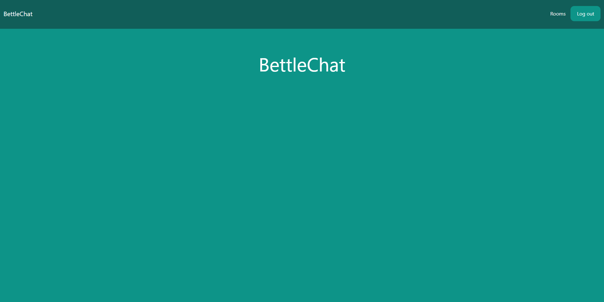
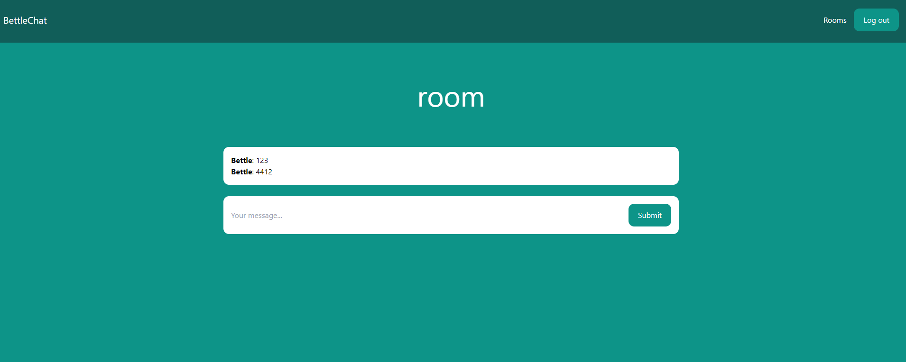

# BettleChatV2
### Description
Real time chat with authentication using Django and Channels with PostgreSQL



### Tech
- Python 3.10
- Django 4.1.3
- Channels 3.0.4

### How to lauch project?
- install virtual enviroment
- install all requirements
```pip install -r requirements.txt```
- change a secret key in settings.py to your own like :
```SECRET_KEY = awduaw123huhanj65o785lz```

- if you want to launch this app with sqlite(default database) you will need to change database in settings.py:
```
DATABASES = {
    'default': {
        'ENGINE': 'django.db.backends.sqlite3',
        'NAME': os.path.join(BASE_DIR, 'db.sqlite3'),
    } 
}
```


- in the folder with the manage.py file, run the command:

```python3 manage.py runserver```
